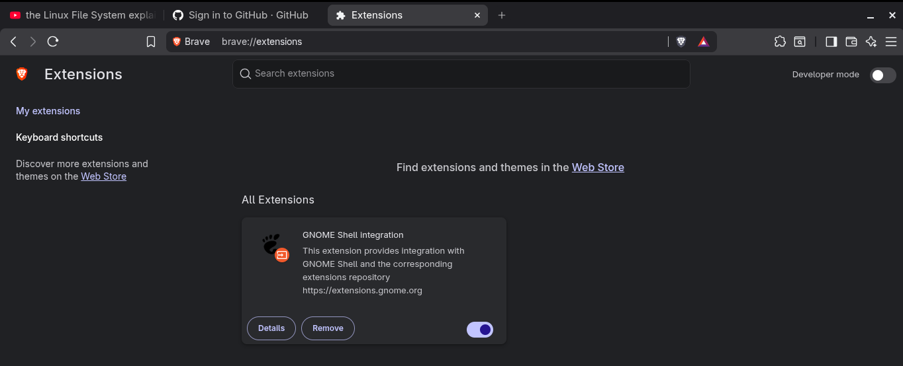
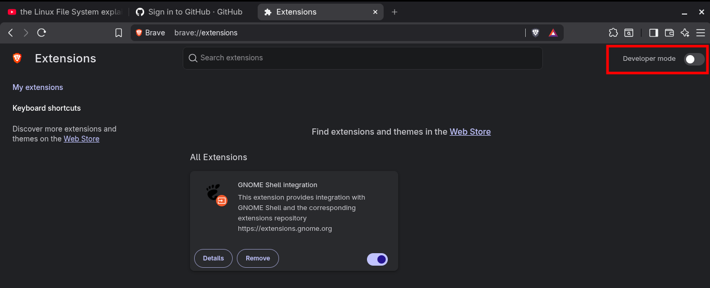
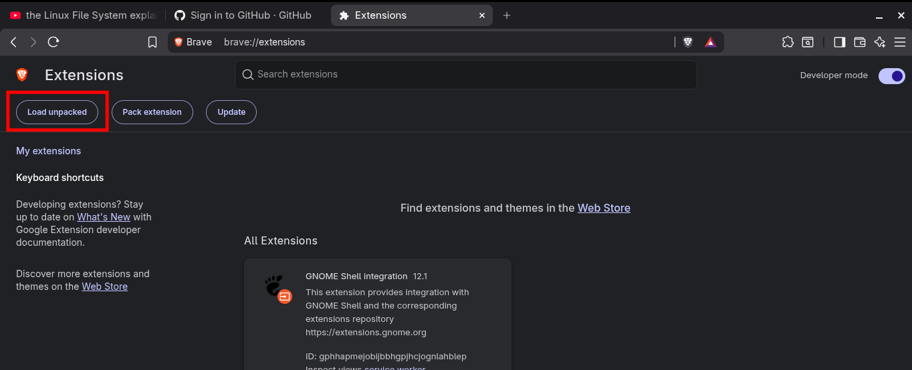
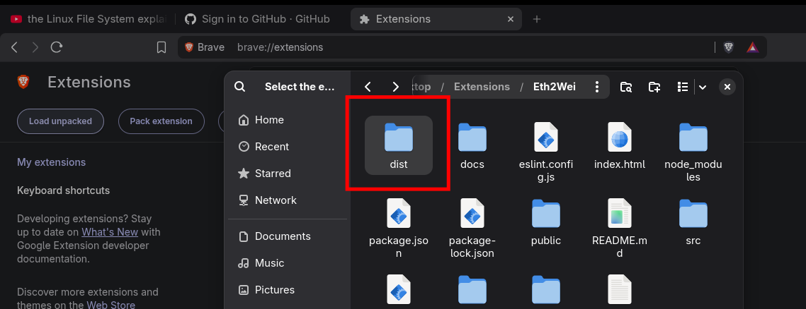
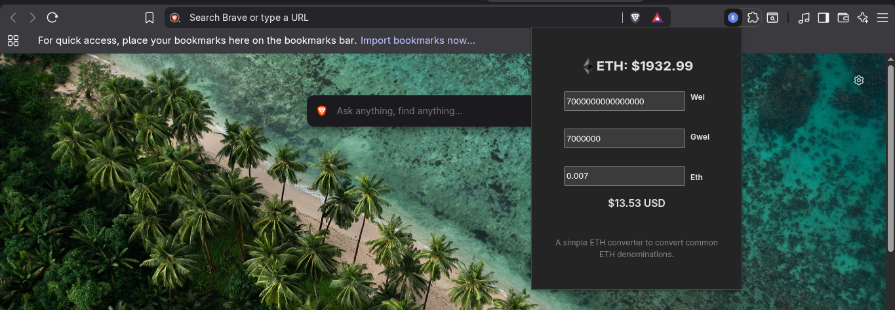
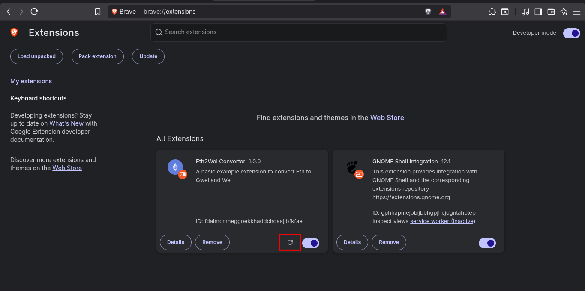

# Eth2Wei Converter

A browser extension that converts between **Ether (ETH)**, **Gwei**, and **Wei**, and shows the live USD value at the current ETH price. Built with React + Vite as a Manifest V3 popup extension.

This extension is **not** published on the Google Web Store. It is meant to be loaded locally as an unpacked extension in any Chromium-based browser (Chrome, Edge, Brave, Vivaldi, Opera). This guide walks you through building it and loading it yourself.

---

## Prerequisites

You will need:

- **Node.js** v18 or newer (and npm, which comes with it). Check with:

  ```bash
  node --version
  npm --version
  ```

- A **Chromium-based browser** (Chrome, Edge, Brave, Vivaldi, or Opera). Firefox and Safari use a different extension format and are not supported by these instructions.

---

## Step 1 — Get the source code

Clone the project (or copy the folder) onto your machine:

```bash
git clone https://github.com/Sly611/Eth2Wei.git
cd Eth2Wei
```

## Step 2 — Install dependencies

Install the project dependencies with npm:

```bash
npm install
```

This downloads everything needed to build the extension. It only needs to be run once, and again only if the dependencies in `package.json` change.

## Step 3 — Build the extension

Run the production build:

```bash
npm run build
```

This compiles the React app and copies the extension `manifest.json` and icons into the **`dist/`** folder. The `dist/` folder is the finished, loadable extension — you do **not** load the source folder directly.

After a successful build, `dist/` will contain:

```
dist/
  index.html            # the popup page
  manifest.json         # MV3 manifest
  icon-16.png
  icon-32.png
  icon-128.png
  assets/               # compiled JS + CSS bundles
```

> **Tip:** If you change any source files later, just run `npm run build` again. You can then reload the extension in the browser (see Step 5) to pick up the changes.

---

## Step 4 — Open the extensions page

1. Open your Chromium-based browser.
2. In the address bar, type one of the following and press Enter:
   - **Chrome:** `chrome://extensions`
   - **Edge:** `edge://extensions`
   - **Brave:** `brave://extensions`
   - **Vivaldi:** `vivaldi://extensions`

<!-- Screenshot: the chrome://extensions page -->



---

## Step 5 — Enable Developer mode

Toggle **Developer mode** on (top-right corner of the extensions page).

<!-- Screenshot: Developer mode toggle turned on, revealing "Load unpacked" button -->



---

## Step 6 — Load the unpacked (built) extension

1. Click the **Load unpacked** button that appears after enabling Developer mode.
2. A folder picker opens. Select the **`dist/`** folder you created in Step 3 (†do NOT select the project root or `src/`). The manifest lives at the root of `dist/`, so that is the folder the browser wants.
3. The Eth2Wei Converter extension now appears in your extensions list.

<!-- Screenshot: folder picker pointed at the dist folder -->



<!-- Screenshot: the extension now showing in the extensions list -->



---

## Step 7 — Open the popup and use it

1. Click the **puzzle-piece icon** (Extensions) in the browser toolbar.
2. Find **Eth2Wei Converter** and click it (pin it for easy access).
3. The popup opens. Type a value in any of the **Wei**, **Gwei**, or **Eth** boxes; the other two (and the USD value) update automatically.

<!-- Screenshot: the toolbar extensions menu with Eth2Wei Converter -->



---

## Updating the extension after changes

When you change the source code, you need to rebuild and reload:

1. In the project folder, run:

   ```bash
   npm run build
   ```

2. Go back to `chrome://extensions` (or your browser's equivalent).
3. Click the **reload** icon on the Eth2Wei Converter card.

<!-- Screenshot: the reload icon on the installed extension card -->



---

## Troubleshooting

- **"No manifest found" when loading unpacked:** You selected the wrong folder. Load the **`dist/`** folder, the one that directly contains `manifest.json`.
- **The popup shows "Price unavailable: $0":** The extension reached the live price API (CoinGecko) and failed — check your internet connection, or that CoinGecko is reachable from your network.
- **Changes don't show up:** You forgot to rebuild (`npm run build`) or to click the reload icon on the extension card.
- **"Developer mode" option is missing:** You may be in a browser managed by an organization (school/work). Local extension loading is sometimes disabled by policy; check with your administrator.

---

## Tech stack

- React 19 + Vite 7
- Manifest V3 browser extension (popup action)
- Live ETH→USD price via the CoinGecko public API
- BigInt-based conversions for exact wei math above 2^53
